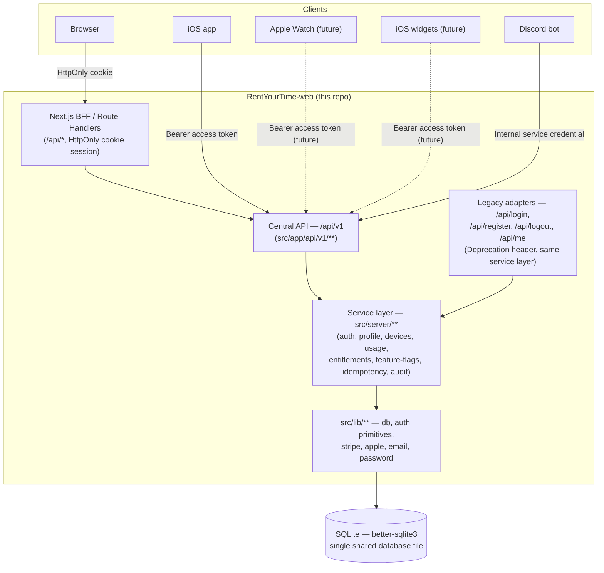
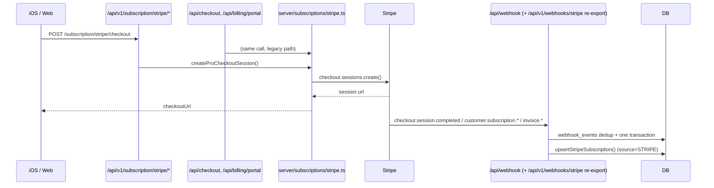

# API Architecture

Central API for RentYourTime — web, iOS, watchOS, iOS widgets, and the Discord bot
all speak to the **same** `/api/v1`, backed by the **same** database. This document
describes the shape of that API; see [`docs/API_ENDPOINTS.md`](./API_ENDPOINTS.md) for
the full endpoint list and [`docs/AUDIT.md`](./AUDIT.md) for what existed before this
work and why each decision below was made.

## High-level architecture



`/api/v1` stays inside `RentYourTime-web` — no separate microservice. The Discord bot
(`bot/`) is a separate long-running Node process; it currently reads the shared SQLite
file directly for waitlist/beta-tester data (`bot/db.js`). This pass does not change
`bot/` — see [`docs/AUDIT.md`](./AUDIT.md) for why, and the "Discord bot" note below for
the intended eventual path.

## Directory layout

```
src/
├── app/
│   ├── api/
│   │   ├── v1/                  ← this work: auth, profile, devices, usage,
│   │   │                          subscription, account, push, config, webhooks
│   │   ├── login/, register/, logout/, me/   ← legacy adapters (Deprecation header)
│   │   └── ...                  ← everything else: unchanged (waitlist, founders,
│   │                               contributions, billing, admin, webhook, ...)
│   ├── health/, ready/          ← liveness/readiness (§21)
│   └── (pages unchanged)
├── server/                      ← this work: the service layer
│   ├── auth/                    (tokens.ts, sessions.ts, service.ts, passwordReset.ts)
│   ├── profile/, devices/, usage/, entitlements/, feature-flags/
│   ├── subscriptions/stripe.ts  (shared by legacy + v1 checkout/portal)
│   ├── account/, idempotency/, audit/, validation/
├── lib/
│   ├── http/                    ← this work: envelope, errors, requestId,
│   │                               deprecation, security, body, rateLimit, config
│   ├── crypto/jwt.ts            ← this work: HS256 access tokens
│   └── (db.ts, auth.ts, password.ts, stripe.ts, subscriptions.ts, founders.ts,
│         apple-subscriptions.ts, email.ts, email-verification.ts — unchanged,
│         reused by both the legacy adapters and the new service layer)
└── emails/                      (+ this work: password-reset-email.ts)
```

A route handler under `src/app/api/v1/**` does exactly five things, per the brief:

1. read the request (headers, body via `readV1JsonBody`, query params),
2. authenticate (`requireAuth(req)` from `@/server/auth/service`),
3. validate shape (route) — range/format rules live in the service,
4. call one `src/server/**` service function,
5. return `apiSuccess(...)` or let a thrown `ApiError` become the error response.

No route handler talks to `getDb()` directly for business logic; only the `src/server/**`
and `src/lib/**` layers do.

## Response envelope

Success:

```json
{ "data": { "...": "..." }, "meta": { "requestId": "req_..." } }
```

Error:

```json
{
  "error": { "code": "VALIDATION_ERROR", "message": "...", "fields": { "email": "..." } },
  "meta": { "requestId": "req_..." }
}
```

Implemented in [`src/lib/http/envelope.ts`](../src/lib/http/envelope.ts). Every route is
wrapped in `withApiRoute(...)`, which:

- generates one `requestId` (`req_<24 hex chars>`, [`src/lib/http/requestId.ts`](../src/lib/http/requestId.ts))
  shared by the success/error path and by any server-side log line, for correlation;
- catches `ApiError` (expected — a specific HTTP status + machine-readable `code` +
  human `message`, see [`src/lib/http/errors.ts`](../src/lib/http/errors.ts)) and maps
  it straight to the envelope;
- catches anything else (a genuine bug) and returns a generic `SERVER_ERROR` — the raw
  exception (stack trace, message, SQL fragment) is only ever `console.error`'d with the
  `requestId` prefix, never sent to the client;
- sets `Cache-Control: no-store` and `X-Content-Type-Options: nosniff` on every response
  (private data by default — no endpoint opts out).

Error codes are centralized in `ERROR_CODES` (one HTTP status per code, so it can never
drift between endpoints): `VALIDATION_ERROR` (422), `UNAUTHORIZED`/`INVALID_CREDENTIALS`/
`TOKEN_EXPIRED`/`TOKEN_INVALID`/`TOKEN_REUSE_DETECTED` (401), `FORBIDDEN` (403),
`NOT_FOUND`/`DEVICE_NOT_FOUND` (404), `CONFLICT`/`EMAIL_TAKEN`/`VERSION_CONFLICT` (409),
`PAYLOAD_TOO_LARGE` (413), `UNSUPPORTED_MEDIA_TYPE` (415), `IDEMPOTENCY_KEY_REUSED` (422),
`RATE_LIMITED` (429), `SERVER_ERROR` (500), `NOT_IMPLEMENTED` (501),
`SERVICE_UNAVAILABLE`/`MAINTENANCE` (503).

None of these ever include a stack trace, a SQL fragment, a file path, a secret, or
anything that would let a caller enumerate whether an email/account exists (login,
register, and forgot-password all return the same generic response either way).

## Versioning & base URLs

- Path-based: `/api/v1`.
- Development: `https://dev.rentyourtime.atlashc.pl/api/v1`
- Production: `https://api.rentyourtime.app/api/v1`
- Read from exactly one place: `API_BASE_URL` (`.env`) →
  [`src/lib/http/config.ts`](../src/lib/http/config.ts)'s `apiBaseUrl()` — no file
  hardcodes a base URL. The iOS/Watch/widget clients should do the same (one constant,
  driven by their own build configuration, never scattered per-call-site) — see
  [`docs/IOS_API_INTEGRATION.md`](./IOS_API_INTEGRATION.md).
- `docs/openapi.yaml` declares both `servers:` entries so it's a valid contract for
  either environment without edits.

Legacy endpoints (`/api/login`, `/api/register`, `/api/logout`, `/api/me`) stay at their
current flat paths — see [`docs/AUTH_MIGRATION.md`](./AUTH_MIGRATION.md).

## Security

- **Rate limiting**: every mutating/sensitive v1 route calls `enforceRateLimit(...)`
  (`src/lib/http/rateLimit.ts`), which wraps the existing `rateLimit()` fixed-window
  limiter (`src/lib/auth.ts`, unchanged, same `rate_limits` table every legacy route
  already uses) and throws `RATE_LIMITED` with the original `Retry-After` header
  preserved.
- **Request size limits**: `readV1JsonBody()` (`src/lib/http/body.ts`) wraps the
  existing `readJsonBody()` (Content-Type + byte-cap enforcement) unchanged.
- **CORS allowlist**: `CORS_ALLOWED_ORIGINS` (`src/lib/http/security.ts`) — the web
  BFF's cookie-authenticated requests are same-origin; a cross-origin caller is only
  ever echoed back if it's on the allowlist, and credentials are never permitted for
  `*`.
- **CSRF / Origin validation**: `assertSameOrigin()` — used by any future
  cookie-authenticated mutating route (Bearer-token calls from iOS/Watch/bot don't rely
  on ambient cookie auth, so they're exempt by construction).
- **Trusted proxy**: `trustedClientIp()` never trusts `X-Forwarded-For` unless
  `TRUSTED_PROXY_COUNT` says how many hops were added by proxies you control (default 0
  — untrusted).
- **Idempotency**: `Idempotency-Key` header, `src/server/idempotency` — keyed by
  `(userId, key, endpoint)`; a retried request with the same key+endpoint+body replays
  the first response instead of re-running side effects; a different body with the same
  key is rejected (`IDEMPOTENCY_KEY_REUSED`).
- **Audit log**: `src/server/audit` — an append-only `audit_log` table. Never receives a
  password/token/secret in `metadata`. Written on every security-relevant event: login,
  refresh-token reuse detection, logout-all/others, password change/reset,
  entitlement grants, account deletion.
- **Security headers**: `Cache-Control: no-store` + `X-Content-Type-Options: nosniff`
  per response (above); global CSP/HSTS-adjacent headers already set project-wide in
  `next.config.ts` (unchanged).
- **Password hashing**: unchanged — `src/lib/password.ts`'s scrypt, reused by both the
  legacy and v1 auth code paths (see [`docs/AUTH_MIGRATION.md`](./AUTH_MIGRATION.md)).

## Subscriptions (Stripe) — no second webhook



`POST /api/v1/subscription/stripe/checkout` and `.../portal` are thin wrappers around
`src/server/subscriptions/stripe.ts`'s `createProCheckoutSession()` /
`createBillingPortalSession()` — the exact same functions the legacy `/api/checkout` and
`/api/billing/portal` now call too (refactored to remove the duplicate Stripe-calling
code, not to change behavior — see `docs/AUDIT.md`). `POST /api/v1/webhooks/stripe` is a
literal re-export of the existing `/api/webhook` handler (`export { POST } from
"@/app/api/webhook/route"`) — there is exactly one webhook implementation, registered at
whichever URL the Stripe Dashboard is pointed at (see
[`docs/PRODUCTION_CHECKLIST.md`](./PRODUCTION_CHECKLIST.md)).

## Feature flags & remote config

See [`docs/API_ENDPOINTS.md`](./API_ENDPOINTS.md#get-apiv1config) — `GET /api/v1/config`,
backed by `src/server/feature-flags`. Rollout is deterministic
(`sha256(userId:featureKey)` bucketed 0-99), never `Math.random()` per request.

## What this pass does not do

- No new database engine (SQLite stays authoritative — see
  [`docs/DATABASE_MIGRATION.md`](./DATABASE_MIGRATION.md)).
- No change to `bot/` (still reads the shared SQLite file directly for waitlist/beta
  data). The architecture above shows the Discord bot's *intended* path once it needs
  write access to sessions/entitlements: an `INTERNAL`-platform service-account bearer
  token against `/api/v1`, exactly like any other client — not a new access mechanism.
- No real Apple JWS verification (unchanged from before this pass — see
  [`docs/APPLE_SUBSCRIPTIONS.md`](./APPLE_SUBSCRIPTIONS.md)).
