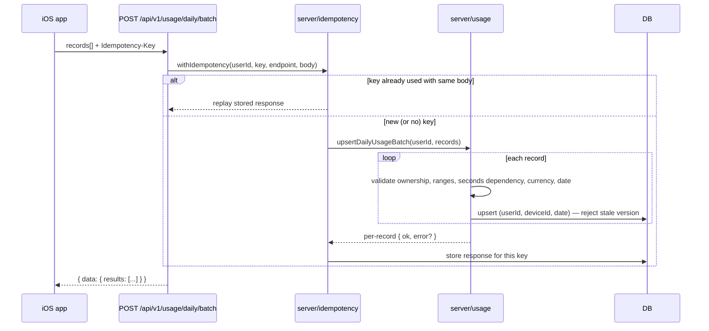

# API Endpoints

Base URL: `API_BASE_URL` (dev: `https://dev.rentyourtime.atlashc.pl/api/v1`, prod:
`https://api.rentyourtime.app/api/v1`). Full machine-readable contract:
[`docs/openapi.yaml`](./openapi.yaml).

Auth column: **Bearer** = `Authorization: Bearer <accessToken>` required
(`requireAuth()`, `src/server/auth/service.ts`). **—** = no auth required. All
responses use the [envelope](./API_ARCHITECTURE.md#response-envelope).

## `/api/v1/auth`

| Method | Route | Auth | Notes |
|---|---|---|---|
| POST | `/auth/register` | — | 5/15min/IP. Creates the account **and** logs it in (returns `session`), like the legacy `/api/register`. |
| POST | `/auth/login` | — | 10/15min/IP. Optional `platform`, `deviceId` (must already belong to the account). |
| POST | `/auth/refresh` | — (refresh token in body) | 30/15min/IP. Rotates the refresh token; reuse of an already-rotated token revokes the whole session family (§7/§8). |
| POST | `/auth/logout` | — (refresh token in body) | Idempotent. Works even if the access token has since expired. |
| POST | `/auth/logout-all` | Bearer | Revokes every session for the account. |
| POST | `/auth/logout-others` | Bearer | Revokes every session **except** the caller's. |
| GET | `/auth/me` | Bearer | `{ id, email, displayName, emailVerified, role }`. |
| POST | `/auth/verify-email` | — | 20/15min/IP. Same tokens/table as the legacy `/api/verify-email`. |
| POST | `/auth/resend-verification` | Bearer | 3/hour/user. |
| POST | `/auth/forgot-password` | — | 5/15min/IP. Always returns generic success — no account-existence leak. New capability (didn't exist pre-migration). |
| POST | `/auth/reset-password` | — | 10/15min/IP. Revokes every session + legacy token on success. |
| POST | `/auth/change-password` | Bearer | Revokes every other session (keeps the caller's). |

## `/api/v1/profile`

| Method | Route | Auth | Notes |
|---|---|---|---|
| GET | `/profile` | Bearer | Lazily creates a default row on first read. |
| PATCH | `/profile` | Bearer | Optimistic concurrency via `version` — mismatch → 409 `VERSION_CONFLICT`. |

## `/api/v1/devices`

| Method | Route | Auth | Notes |
|---|---|---|---|
| POST | `/devices/register` | Bearer | Upsert by `installationId`. Binds the device to the calling session if that session has none yet. |
| PATCH | `/devices/current` | Bearer | "Current" = the device bound to the caller's session — never a client-supplied id. |
| GET | `/devices` | Bearer | Active (non-revoked) devices only. |
| DELETE | `/devices/:id` | Bearer | Revokes the device **and every session tied to it** (§11). |

## `/api/v1/usage`

| Method | Route | Auth | Notes |
|---|---|---|---|
| POST | `/usage/daily` | Bearer | Upsert key `(userId, deviceId, date)`. Supports `Idempotency-Key`. |
| POST | `/usage/daily/batch` | Bearer | Up to 100 records/request; partial success — one bad record never fails the others. Supports `Idempotency-Key`. |
| GET | `/usage/daily` | Bearer | Query: `from`, `to`, `deviceId` (all optional). |
| GET | `/usage/summary` | Bearer | Query: `from`, `to` (default: trailing 30 days). |
| GET | `/usage/trends` | Bearer | Same query, one point per day. |

`virtualRentAmountMinor` is informational only — it never triggers an automatic charge
(§12). Money is always in minor units (cents), matching `billing_records`/
`contributions`/`founder_purchases`.

## `/api/v1/subscription`

| Method | Route | Auth | Notes |
|---|---|---|---|
| GET | `/subscription/status` | Bearer | `EntitlementService.getUserAccess()` — see [`docs/ENTITLEMENTS.md`](./ENTITLEMENTS.md). |
| POST | `/subscription/stripe/checkout` | Bearer | Wraps the same Stripe logic as the legacy `POST /api/checkout`. |
| POST | `/subscription/stripe/portal` | Bearer | Wraps the same logic as the legacy `POST /api/billing/portal`. |
| POST | `/subscription/apple/verify` | Bearer | Structural placeholder — 501 until real JWS verification exists. See [`docs/APPLE_SUBSCRIPTIONS.md`](./APPLE_SUBSCRIPTIONS.md). |
| POST | `/subscription/apple/restore` | Bearer | Same contract as `verify` — Apple has no separate "restore" API; it's the same signed transaction resubmitted. |

## `/api/v1/account`

| Method | Route | Auth | Notes |
|---|---|---|---|
| POST | `/account/export` | Bearer | 5/hour/user. Never includes `passwordHash` or any token hash. |
| DELETE | `/account` | Bearer | Requires `{ password, confirm: true }`. Revokes all sessions; soft-deletes + scrubs the account (billing/tax records are retained — see [`docs/PRODUCTION_CHECKLIST.md`](./PRODUCTION_CHECKLIST.md#data-retention)). |

## `/api/v1/push`

| Method | Route | Auth | Notes |
|---|---|---|---|
| POST | `/push/register` | Bearer | `{ deviceId, pushToken, pushEnvironment }` — token is never logged. |
| DELETE | `/push/current` | Bearer | Clears the push token for the session's current device. |

## `/api/v1/config`

| Method | Route | Auth | Notes |
|---|---|---|---|
| GET | `/config` | Optional Bearer | `{ maintenance, minimumAppVersion, latestAppVersion, features, requiresPro, requiresFounder, founderEarlyAccess }`. Public — an invalid/missing token is treated as "not logged in", never rejected. |

## `/api/v1/webhooks`

| Method | Route | Auth | Notes |
|---|---|---|---|
| POST | `/webhooks/stripe` | Stripe signature | Re-export of `/api/webhook` — not a second implementation (§14). |
| POST | `/webhooks/apple` | — | Re-export of the existing structural placeholder — always 501 today. |

## Health

| Method | Route | Notes |
|---|---|---|
| GET | `/health` | Liveness — `{ status: "ok" }`, no DB access. |
| GET | `/ready` | Readiness — checks the database is reachable; 503 if not. Never reveals the DB path/connection string. |

## Legacy endpoints (unchanged, `/api/*`)

Everything not listed above keeps working exactly as before — waitlist, teams pilot,
contributions, Founder Program, billing history, admin panel, the Stripe/Apple
webhooks. Full list and current behavior: the project [`README.md`](../README.md) and
[`docs/AUDIT.md`](./AUDIT.md#endpoint-disposition).

### Becoming compatibility adapters (Deprecation header, same underlying logic)

| Legacy route | v1 successor |
|---|---|
| `POST /api/register` | `POST /api/v1/auth/register` |
| `POST /api/login` | `POST /api/v1/auth/login` |
| `POST /api/logout` | `POST /api/v1/auth/logout` |
| `GET /api/me` | `GET /api/v1/auth/me` + `GET /api/v1/subscription/status` |

Each of these four responses now carries `Deprecation: true` and
`Link: <successor>; rel="successor-version"` (RFC 8594) — see
[`docs/AUTH_MIGRATION.md`](./AUTH_MIGRATION.md) for the retirement plan. Their internal
logic is untouched; only the header wrapper (`src/lib/http/deprecation.ts`) was added.
