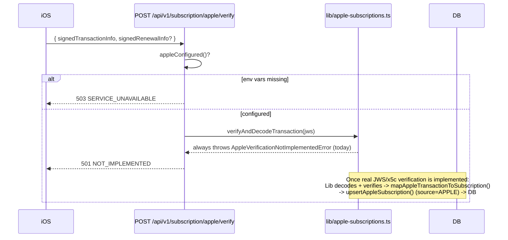

# Apple App Store subscriptions — scaffolding only

**Nothing in this integration is functional yet.** This document exists so nobody
mistakes the presence of these files/endpoints for a working Apple integration.

## What exists

- `src/lib/apple-subscriptions.ts` — types (`AppleDecodedTransaction`,
  `AppleDecodedRenewalInfo`, `AppleNotificationType`), config helpers, and
  `mapAppleTransactionToSubscription()` (a pure mapping function, ready to use).
- `POST /api/subscriptions/apple/sync` — Bearer-authenticated, rate-limited
  (10 / 10 min / **user**, not IP). Accepts
  `{ signedTransactionInfo, signedRenewalInfo? }`.
- `POST /api/webhooks/apple` — structural placeholder for App Store Server
  Notifications V2.
- `upsertAppleSubscription()` in `src/lib/subscriptions.ts` — fully implemented and
  unit-tested, writes a `source = 'APPLE'` row exactly like the Stripe path does.
- **New in the `/api/v1` central-API pass** (docs/API_ARCHITECTURE.md) — thin wrappers
  over the exact same functions above, with the exact same 501/503 contract (nothing new
  is trusted, nothing new grants Pro):
  - `POST /api/v1/subscription/apple/verify` — same body shape as the legacy `sync`
    endpoint.
  - `POST /api/v1/subscription/apple/restore` — Apple has no separate "restore
    purchases" server API; the client resubmits the same signed transaction JWS it
    already holds, so this calls the identical `verifyAndDecodeTransaction()`. Kept as
    its own route only because the client-side trigger differs (silent background call
    vs. an explicit "Restore Purchases" button).
  - `POST /api/v1/webhooks/apple` — a literal re-export (`export { POST } from
    "@/app/api/webhooks/apple/route"`) of the same structural placeholder, not a second
    implementation.



Product IDs (`.env.example`): `APPLE_MONTHLY_PRODUCT_ID=com.rentyourtime.app.pro.monthly`,
`APPLE_ANNUAL_PRODUCT_ID=com.rentyourtime.app.pro.annual` — read by the (future) real
verifier to reject a JWS whose `productId` doesn't match either configured value, and by
`planFromAppleProductId()`'s eventual real replacement (today a naming-convention
heuristic — see the source comment).

## What does NOT exist

**Real JWS signature verification.** `verifyAndDecodeTransaction()` and
`verifyAndDecodeRenewalInfo()` in `apple-subscriptions.ts` always throw:

- `AppleConfigError` (→ **503** `server_not_configured`) if `APPLE_ISSUER_ID`,
  `APPLE_KEY_ID`, `APPLE_PRIVATE_KEY`, or `APPLE_BUNDLE_ID` are missing.
- `AppleVerificationNotImplementedError` (→ **501** `not_implemented`) otherwise.

Neither function decodes or trusts the payload in any way. This is intentional, not
an oversight: verifying an Apple signed transaction means validating the `x5c`
certificate chain in the JWS header against Apple's root CA — that requires
integrating Apple's App Store Server Library (or reimplementing it) and is real,
non-trivial work. **Do not build a verifier that just returns `true`** — that would
let anyone grant themselves Pro by POSTing a fabricated payload.

`POST /api/webhooks/apple` reads and discards the request body without parsing it,
and always returns 501. **Do not register this URL in App Store Connect** until
verification is implemented — Apple will retry a non-2xx response for a while and
then give up, which is the correct behavior for an endpoint that isn't live yet.

## Finishing this integration (future work)

1. Implement real verification in `verifyAndDecodeTransaction` /
   `verifyAndDecodeRenewalInfo` (Apple's App Store Server Library, or manual JWS +
   x5c chain validation against Apple's root certificates).
2. Wire `POST /api/subscriptions/apple/sync` (and `/api/v1/subscription/apple/verify`)
   to call `mapAppleTransactionToSubscription()` and `upsertAppleSubscription()` once
   verification succeeds — the plumbing already exists, only the `throw` needs to be
   replaced with real decoded data. Before calling `upsertAppleSubscription()`, check
   whether `originalTransactionId` is already attached to a *different* `userId` (query
   `subscriptions WHERE original_transaction_id = ?`) and reject the sync rather than
   silently reassigning it — Apple's `originalTransactionId` is the durable identity of
   a subscription across renewals, and the brief (§15) requires "zapobiec przypisaniu
   tego samego zakupu do dwóch kont."
3. Implement the `POST /api/webhooks/apple` switch over `notificationType`
   (`AppleNotificationType` in `apple-subscriptions.ts` documents the mapping this
   was designed for: `SUBSCRIBED`/`DID_RENEW` → `active`, `DID_FAIL_TO_RENEW` →
   `past_due`, `EXPIRED`/`GRACE_PERIOD_EXPIRED` → `expired`, `REFUND` → `refunded`,
   `REVOKE` → `canceled`).
4. Only then register the webhook URL in App Store Connect and set `APPLE_ISSUER_ID`
   / `APPLE_KEY_ID` / `APPLE_PRIVATE_KEY` / `APPLE_BUNDLE_ID` in production.

## Env vars

```
APPLE_BUNDLE_ID=com.rentyourtime.app
APPLE_ISSUER_ID=
APPLE_KEY_ID=
APPLE_PRIVATE_KEY=
APPLE_ENVIRONMENT=Sandbox
APPLE_MONTHLY_PRODUCT_ID=com.rentyourtime.app.pro.monthly
APPLE_ANNUAL_PRODUCT_ID=com.rentyourtime.app.pro.annual
```

All optional today — their absence just means `apple/sync` returns 503 instead of
501. Never commit real values; see `.env.example`.
