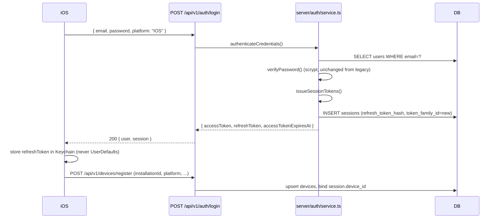
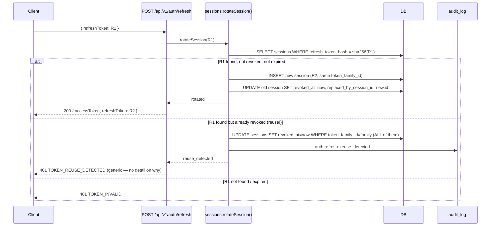

# Auth Flow (`/api/v1`)

Token/session model for the central API. For the legacy Bearer-token system this
coexists with during migration, see [`docs/AUTH_MIGRATION.md`](./AUTH_MIGRATION.md).

## Tokens

**Access token** — short-lived (`ACCESS_TOKEN_TTL_SECONDS`, default 900s = 15 min),
stateless HS256 JWT (`src/lib/crypto/jwt.ts` — hand-rolled sign/verify, no external JWT
library, matching this project's existing "no NextAuth" stance; still a standard
compact `header.payload.signature` JWS any generic decoder can read). Claims:

```json
{ "sub": "user_id", "sessionId": "session_id", "role": "USER", "iss": "...", "aud": "...", "iat": 0, "exp": 0 }
```

Never carries `isPro`/`isFounder`/any entitlement — those are always re-read from
`EntitlementService` server-side (`GET /api/v1/subscription/status`), never trusted from
a claim (§13). `role` is present for client convenience only; every server-side
authorization check re-reads `users.role` fresh (`requireAuth()` in
`src/server/auth/service.ts`), not the claim.

**Refresh token** — random 256-bit value (`randomBytes(32)`), returned to the client
once. Only its SHA-256 hash is stored, in the new `sessions` table (`src/server/auth/sessions.ts`)
— never the legacy `tokens` table. Bound to a `Session` (and, once registered, a
`Device`): `platform`, `deviceId`, `ipAddress`, `userAgent`, `createdAt`, `lastUsedAt`,
`expiresAt`, `revokedAt`, `replacedBySessionId`.

## Login — iOS



## Login — Web

```mermaid
sequenceDiagram
    participant Browser
    participant BFF as Next.js page/action (same origin)
    participant API as POST /api/v1/auth/login
    participant DB

    Browser->>BFF: form submit (same-origin, cookies not yet set)
    BFF->>API: { email, password, platform: "WEB" } (server-to-server, same process)
    API->>DB: authenticate + create session
    API-->>BFF: { accessToken, refreshToken, accessTokenExpiresAt }
    BFF->>Browser: Set-Cookie: rt=<refreshToken>; HttpOnly; Secure; SameSite=Lax; Path=/api/v1/auth
    BFF-->>Browser: redirect to /account
    Note over Browser,BFF: The browser never sees accessToken or refreshToken in JS —<br/>only an HttpOnly cookie. See docs/WEB_API_INTEGRATION.md.
```

The web app is expected to act as its own BFF: it calls `/api/v1/auth/*` server-side
(same Next.js process) and stores only the refresh token, HttpOnly, never in
`localStorage`/`sessionStorage`/a URL. See
[`docs/WEB_API_INTEGRATION.md`](./WEB_API_INTEGRATION.md) for the cookie contract, CSRF,
and how this differs from what the legacy `/api/login` does today (a bearer token
returned to client JS, currently stored by the web client itself outside this repo's
control — the BFF pattern above is the migration target, not yet wired into the existing
`AuthPanel.tsx`/`AccountClient.tsx` components in this pass; see
[`docs/WEB_API_INTEGRATION.md`](./WEB_API_INTEGRATION.md#status)).

## Refresh rotation & reuse detection



Reuse detection covers the classic "stolen refresh token" scenario: if an attacker
captures `R1` and the legitimate client has already rotated to `R2`, the attacker's use
of `R1` is detected (it's marked revoked) and the *entire family* — every session ever
descended from that original login — is revoked. The legitimate client's next API call
with `R2` will also start failing (its session got revoked too), forcing a fresh login
everywhere. This is a deliberate trade-off: a false positive (e.g. a client retrying a
timed-out refresh call) costs one forced re-login; silently trusting reuse would let a
stolen token persist indefinitely.

## Session management endpoints

`POST /api/v1/auth/logout` (revokes one session, works even with an expired access
token — the refresh token alone identifies the session), `logout-all` (every session),
`logout-others` (every session except the caller's — "sign out everywhere else").
`DELETE /api/v1/devices/:id` also revokes every session tied to that device (§11).

## Password reset

New capability — the legacy system never had one (`docs/AUTH.md`'s "Known limitations").
`POST /auth/forgot-password` → `POST /auth/reset-password`, same technique as
`email-verification.ts` (random 256-bit token, SHA-256 hash stored, single-use), 1 hour
TTL (shorter than email verification's 24h, since this token grants account takeover if
leaked). A successful reset revokes every `sessions` row **and** deletes every legacy
`tokens` row for the account — a reset must not leave a pre-reset credential usable
anywhere.
