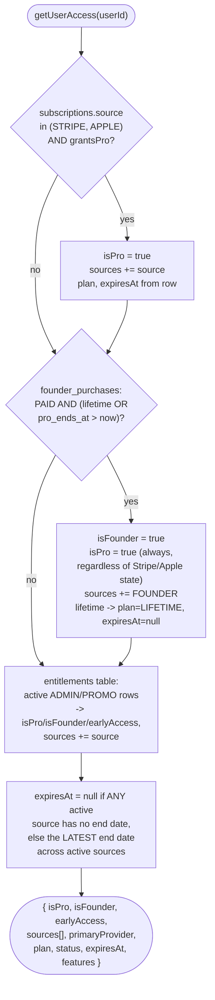

# Entitlements

`EntitlementService.getUserAccess(userId)` — `src/server/entitlements/index.ts` — is the
single place that answers "does this user have Pro / Founder / early access, and why."
Every client (web, iOS, Discord bot) reads entitlement state through
`GET /api/v1/subscription/status`, never by inspecting `subscriptions`/
`founder_purchases` directly, and never by trusting a client-supplied flag.

## Sources

| Source | Table(s) it reads | Written by |
|---|---|---|
| `STRIPE` | `subscriptions` (`source = 'STRIPE'`) | `POST /api/webhook` (and its `/api/v1/webhooks/stripe` re-export) only |
| `APPLE` | `subscriptions` (`source = 'APPLE'`) | `upsertAppleSubscription()`, reachable once real JWS verification lands (§ [`docs/APPLE_SUBSCRIPTIONS.md`](./APPLE_SUBSCRIPTIONS.md)) |
| `FOUNDER` | `founder_purchases` + `founder_tiers` directly (not `subscriptions`) | `settleFounderPurchaseFromSession()` in `src/lib/founders.ts`, from a confirmed Stripe Checkout Session |
| `ADMIN` | `entitlements` (new table, `source = 'ADMIN'`) | `grantManualEntitlement()` — no route wires this to client input yet (see "Not built in this pass" below) |
| `PROMO` | `entitlements` (new table, `source = 'PROMO'`) | same primitive as `ADMIN`, different `source` value |

`EntitlementService` never writes to `subscriptions` or `founder_purchases` — those
stay owned by the webhook / `founders.ts` settlement path exactly as before this pass.
It also deliberately does **not** read `subscriptions.source = 'MANUAL'` (the row
`grantFounderPro()` writes there for `subscriptionGrantsPro()`'s benefit elsewhere in
the app) — Founder access is re-derived straight from `founder_purchases` instead, so a
refunded/failed purchase can never leave a stale `MANUAL` row granting Pro through this
service.

## Merge rules (§13)



- **Founder can grant PRO independently of a paid subscription.** A Founder purchase
  sets `isFounder = true` and `isPro = true` unconditionally — it does not require (or
  check) a Stripe/Apple subscription at all.
- **Apple and Stripe can be active at the same time.** Both are checked; whichever the
  `subscriptions` row's `source` currently is (a user can only have one *provider*
  subscription row at a time — see `upsertStripeSubscription`/`upsertAppleSubscription`)
  contributes its own `sources` entry and `plan`/`expiresAt`.
- **One source expiring doesn't revoke access from another.** `expiresAt` in the
  response is the *latest* end date across every currently-active source, and `null`
  (never expires) wins outright if *any* active source has no end date (a Founder
  lifetime grant, for instance) — even if a separate Stripe subscription has a concrete
  `current_period_end`.
- **A refund removes only the matching entitlement.** `applyFounderRefund()` /
  the Stripe `charge.refunded` handler each only ever touch their own row
  (`founder_purchases.payment_status = 'REFUNDED'` or `subscriptions.status = 'refunded'`
  respectively) — neither one reaches into the other's table. See `src/lib/founders.ts`'s
  own documented limitation: a Founder refund does not automatically claw back Pro time
  already merged into a Stripe/Apple row by `grantFounderPro()` (existing, pre-dates this
  pass) — that remains a manual admin action.
- **The client can never grant itself an entitlement.** Every source above is written
  only by a webhook (Stripe/Apple, signature-verified), a purchase-settlement function
  (`founders.ts`, cross-checked against the Stripe session), or an explicit admin action
  (`grantManualEntitlement`, never reachable from unauthenticated or self-service input).

## Response shape

```json
{
  "isPro": true,
  "isFounder": true,
  "earlyAccess": true,
  "sources": ["FOUNDER", "STRIPE"],
  "primaryProvider": "FOUNDER",
  "plan": "LIFETIME",
  "status": "ACTIVE",
  "expiresAt": null,
  "features": []
}
```

`features` is reserved for a future per-user feature-flag summary — see
[`docs/API_ENDPOINTS.md#apiv1config`](./API_ENDPOINTS.md#apiv1config) for the flag
system itself (`GET /api/v1/config`), which already reads `getUserAccess()` for its
`founderEarlyAccess` field and per-flag `pro_enabled`/`founder_enabled` gating.

## Not built in this pass

- No admin route to call `grantManualEntitlement()`/`revokeManualEntitlement()` — the
  service functions exist (with `AuditLog` writes) but nothing in the client-facing API
  surface reaches them yet. Wiring an admin-only `/api/v1/admin/entitlements` route (or
  extending the existing `/admin` panel, gated by `requireAdmin()`) is straightforward
  follow-up work once there's a concrete comp/promo workflow to support.
